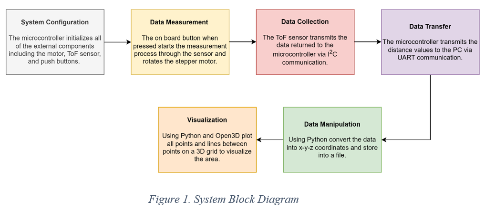
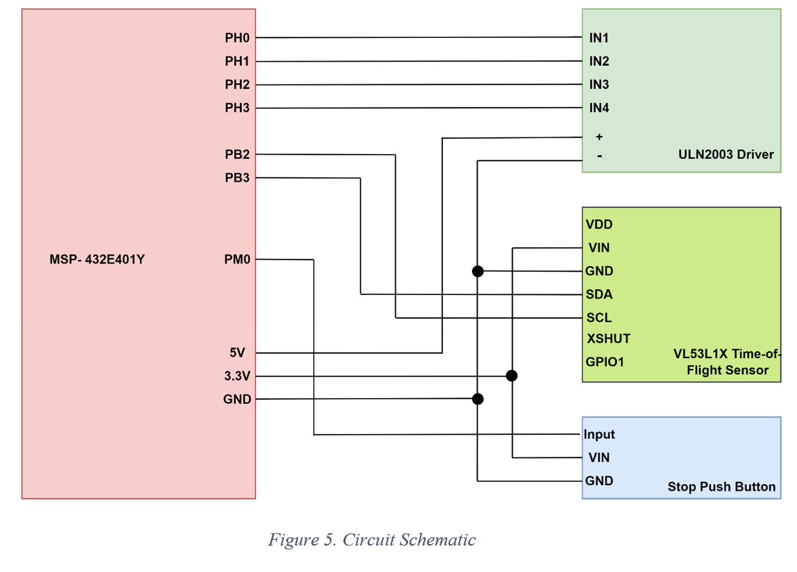

# 2DX4 Final Project

## Project Overview

### General Description
The 2DX Final Spatial Mapping project is a 3D scanning device that captures distances in several 360-degree planes along an orthogonal axis. This allows the device to map the environment in three dimensions. The system is composed of three main components: a microcontroller, a time-of-flight sensor, and a stepper motor.

The microcontroller is responsible for managing all system operations, such as delivering power and configuring other parts of the system, such as the sensor and the motor. It also transmits all the recorded data to an external device through serial communication.

The stepper motor provides a 360-degree range of motion for the device, which allows the mounted time-of-flight sensor to capture distance measurements in the vertical plane. The time-of-flight sensor generates pulses of infrared light and measures the time it takes for the emitted laser pulses to be reflected to the detector to determine distances to objects/surfaces. The sensor then calculates the distance using this timing data based on its configuration settings and transmits it to the microcontroller through the I2C communication. The sensor is mounted to the stepper motor and takes a measurement every 45 degrees, when the onboard button is pressed, and the stepper motor is rotated to capture the 360-degree distance measurements.

The system is connected to a PC capable of serial communication via USB, which is used to run the included Python script (data_visualization.py). The microcontroller sends status messages and distance measurements to the computer via UART. The data can then be read, converted into x-y-z coordinates, and then visualized using a Python script. This allows the user to see a 3D representation of the scanned environment on their computer.

#### Block Diagram

### Features

The spatial mapping system includes the following features:
- Texas Instruments MSP432E401Y Microcontroller (Approximate Cost: $70)
  - Arm Cortex-M4F Processor Core
  -	Bus Speed: 40MHz
  -	Four user LEDs
  -	Two user switches with one independent microcontroller reset switch
-	MOT-28BYJ48 Stepper Motor w/ ULN2003 Driver (Approximate Cost: $6.95)
    - Motor driver includes LED state indicators
    -	Operating voltage range: 5V-12V
    -	512 steps required for a 360-degree rotation (used to mount the ToF sensor)
-	VL53L1X Time-of-Flight Sensor (Approximate Cost: $18.38)
    -	Used for accurate distance measurements configured using I2C communication
    -	Operating voltage range: 2.65V-3.5V
    -	Up to four meters of range
-	External Push Button (Approximate Cost: $0.60)
    -	Used to stop the data acquisition connected to the microcontrollers GPIO pin
-	Data Communication
    -	I2C serial communication between the MSP432E401Y and VL53L1X Time-of-Flight sensor
    -	UART serial communication between the MSP432E401Y and PC (baud rate of 115200) supported via Python (PySerial library supported on Python 3.6-3.9)
-	Data Visualization 
    -	Mapped data is presented using 3D visualization
    -	Open3D Python library used for 3D data processing (Supported on Python 3.9)

#### Device Details

#### System Schematic

### Data Visualization
The 3D visualization of the data is performed by importing the data in the .xyz file format into Python through the Open3D library and then using the various functions provided in the library to visualize the data. The 3D visualization was run on a Lenovo Legion 5 Pro (Windows 11) laptop, featuring an eight-core AMD Ryzen 7 5800H Processor (3.20 GHz), an NVIDIA GeForce RTX 3060 (6GB) graphics card, and 16GB of dual-channel DDR4 memory running at 3200MHz. The Python code was added using the Python IDLE, with the version of Python being 3.9.10.

The data was read and formatted in a suitable format for visualization using the open-source Open3D Python library, which offers functions to read and format data in an appropriate format to be used for visualization. Moreover, some of the functions/libraries used include import serial, math, Open3D, NumPy, and Python file handling. The data first goes into the serial port COM3 for my specific computer, and from the data processing program, the distance measurements are put into a .xyz file (demo2dx.xyz). This file contains the x, y, and z measurements for each distance measurement taken and will include 24 total measurements as we do three scans, each with eight steps as the distance is taken every 45 degrees (example shown below).

#### Programming Logic Flowchart

#### Overall System

